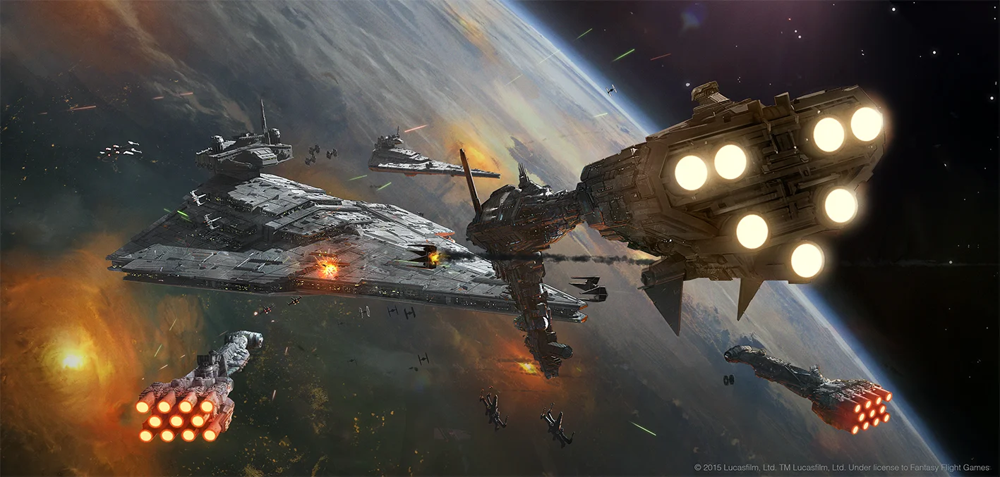

# STARMADA 함대 이미지 생성 웹앱



스타워즈 [아미 빌더](https://armada.ryankingston.com/)의 함대 텍스트 값 기반으로 한글 카드를 조합하여 보여주고,
사용자가 해당 이미지를 다운로드할 수 있도록 하는 Flask 기반 웹 애플리케이션입니다.
원본 로직은 **Big.D** 님의 코드를 바탕으로 웹 버전으로 확장 및 UI를 개선한 버전입니다.

---

## 📌 원작자 및 출처

* **원 개발자:** Big.D
* **원문 출처:** [https://m.blog.naver.com/tantive4/223771925621](https://m.blog.naver.com/tantive4/223771925621)

---

## ✨ 주요 기능

* 함대 텍스트 입력 시 해당 함대 구성에 맞는 이미지 조합
* 웹 브라우저에서 즉시 결과 확인 가능
* 이미지 클릭 시 확대 보기
* 이미지 다운로드 버튼 제공
* HTML/CSS 적용으로 깔끔한 UI


## 📦 설치 방법

1. **저장소 클론 또는 다운로드**

   ```bash
   git clone <저장소 URL>
   cd <프로젝트 디렉토리>
   ```

2. **필수 패키지 설치**

   ```bash
   # 필요 시 가상환경 구성하여 설치
   pip install flask pillow
   ```

---

## 🚀 실행 방법

```bash
python app.py
```

실행 후, 브라우저에서 아래 주소 접속:

```
http://127.0.0.1:5000
```

---

## ⚠️ 주의 사항

* 본 앱은 Flask 개발 서버를 사용하므로, 실제 서비스 배포 시에는 Gunicorn, uWSGI 등의 WSGI 서버와 함께 사용하는 것을 권장합니다.
* 리소스(CSV 및 이미지 파일) 경로가 잘못되면 이미지가 표시되지 않을 수 있습니다.

---

## 📄 라이선스 및 저작권

* 원본 코드의 저작권은 **Big.D** 님에게 있습니다.
* 본 버전은 원작을 참고하여 웹 애플리케이션 형태로 재구성한 것입니다.

---
